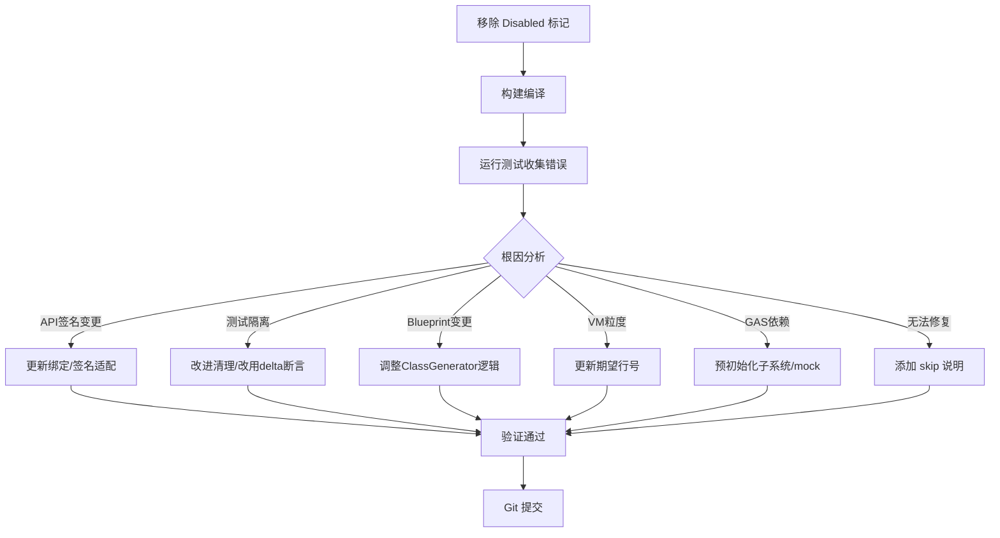

## 用户需求

修复项目中因 UE 5.7 迁移导致的 18 个被 Disabled 的自动化测试，使其重新通过或以正确的方式处理。

## 产品概述

AngelScript 插件在升级到 UE 5.7 后，有 18 个自动化测试因 API 签名变更、元数据布局变化、UFunction 生命周期变更、VM 执行粒度变化、测试隔离污染等原因被标记为 Disabled。需要逐个分析根因并修复，恢复测试套件的完整覆盖。

## 核心功能

- 修复 3 个 UE 5.7 API 签名/元数据变更导致的绑定测试（ScriptMethod mixin、WorldContext、FFrameRate）
- 修复 8 个通用 UE 5.7 回归测试（4 个示例覆盖 + 2 个 EngineHelper + 2 个源码导航）
- 修复 1 个 ReceiveTick Blueprint 注册变更测试
- 修复 1 个 UFunction 生命周期变更测试（IsFunctionImplementedInScript）
- 修复 1 个接口类型生成变更测试（CastFastPath）
- 修复 3 个测试隔离问题（接口签名列表非空、HotReload CDO 污染、接口状态隔离）
- 修复 1 个 VM 执行粒度变更测试（调试器暂停行号）
- 修复 1 个 GAS 子系统依赖崩溃测试

## 技术栈

- C++ (UE 5.7)
- Unreal Engine Automation Test Framework
- AngelScript 脚本引擎 (2.33 + 2.38 兼容)
- 构建工具: UnrealBuildTool, `Tools/RunBuild.ps1`
- 测试工具: `Tools/RunTests.ps1`, `Tools/RunAutomationTests.ps1`

## 实现方案

整体策略是按根因分类，从确定性最高、影响面最小的修复开始，逐步推进到需要深入调查的问题。每个分类形成一个独立的工作批次，修复后立即构建验证，避免回归。

### 关键技术决策

1. **分批修复而非一次性全改**：18 个测试横跨 7 种不同根因，逐批处理可以控制风险，每批修复后立即验证
2. **先启用再修复**：对每个 Disabled 测试，先移除 `EAutomationTestFlags::Disabled` 标记，运行观察实际失败信息，再决定修复方案
3. **修复优先级排序**：API 签名类 > 测试隔离类 > Blueprint 注册类 > 通用回归类 > GAS 依赖类。签名类最确定，隔离类影响其他测试的正确性

### 各分类修复策略

**分类 A（API 签名变更，3 个）**：

- BindConfig 的 ScriptMethod/WorldContext 两个测试：需要检查 UE 5.7 中 UFunction 元数据布局变更（`ScriptMethod` meta key 和 `WorldContext` 参数处理），更新绑定层 `AngelscriptBinds.cpp` 中对应的元数据读取逻辑或调整测试断言
- FFrameRate：检查 UE 5.7 中 `FFrameRate::AsFrameTime` 是否被移除/重命名，更新 `AngelscriptFrameTimeMixinLibrary.h` 绑定或脚本侧调用

**分类 F（测试隔离，3 个）**：

- 接口签名列表非空：SHARE_CLEAN 引擎在 UE 5.7 下预注册了接口签名，修改测试改为基于 delta 断言而非绝对零值
- HotReload CDO 污染：`_REPLACED_` 类从先前测试泄漏，需要在测试前增加更彻底的清理，或改用 SHARE_FRESH 引擎
- 接口状态隔离：与签名列表问题同源

**分类 C/D/E（Blueprint/UFunction/Interface 变更，各 1 个）**：

- ReceiveTick：检查 UE 5.7 中 AActor 的 tick 事件注册机制变更，可能需要调整 ClassGenerator 中的 BlueprintOverride 查找逻辑
- IsFunctionImplementedInScript：UE 5.7 的 UFunction 在 DiscardModule+GC 后不再被清理，需要调查是否需要主动清理或调整断言
- CastFastPath：类型生成失败，需要检查 ClassGenerator 对 UInterface 子类的生成逻辑

**分类 B（通用回归，8 个）**：

- 示例覆盖（4 个）：共享同一根因——Production Engine + FActorTestSpawner 在 UE 5.7 下的子系统初始化流程可能有变化
- EngineHelper（2 个）：调试引擎优先级和组件类释放逻辑，需要逐个跑出实际错误信息
- 源码导航（2 个）：headless 引擎下 generated script class 的解析，可能与 UE 5.7 的类注册时机有关

**分类 G（VM 粒度，1 个）**：

- 调试器暂停位置从 loop body 变到 for-header，这是 VM 行事件粒度变更，修复方案是更新测试中期望的暂停行号

**分类 H（GAS 依赖，1 个）**：

- GAS 属性注册依赖运行中的 UAngelscriptGameInstanceSubsystem，需要在测试中 mock 或预初始化该子系统

## 实现备注

- 每个批次修复后必须执行 `Tools/RunBuild.ps1` 确认编译通过，再执行相关测试验证
- 对于根因不明确的测试（分类 B），第一步是移除 Disabled 标记并运行，收集实际错误日志，再决定修复方案
- 如果某个测试的修复需要改动 Runtime 代码（如 ClassGenerator、Binds），需要同时验证不影响其他已通过的测试
- Git 提交遵循 `Documents/Rules/GitCommitRule.md` 格式
- 对于确认无法在当前架构下修复的测试（如确实需要引擎侧补丁），改为添加明确的 skip 理由注释而非简单 Disabled

## 架构设计

修复工作不涉及架构变更。所有修改限定在以下范围：

1. 测试文件本身（断言调整、隔离改进、行号更新）
2. 绑定层适配（Binds/ 和 FunctionLibraries/ 下的 API 签名适配）
3. ClassGenerator 适配（BlueprintOverride 查找、UFunction 清理逻辑）



## 目录结构

```
Plugins/Angelscript/Source/AngelscriptTest/
├── Core/
│   └── AngelscriptBindConfigTests.cpp              # [MODIFY] 修复 ScriptMethod mixin 和 WorldContext 测试
├── Bindings/
│   ├── AngelscriptFrameTimeFunctionLibraryTests.cpp # [MODIFY] 修复 FFrameRate 签名测试
│   └── AngelscriptGameplayFunctionLibraryTests.cpp  # [MODIFY] 修复 GAS 子系统依赖测试
├── Examples/
│   └── AngelscriptScriptExampleCoverageTests.cpp    # [MODIFY] 修复 4 个示例覆盖测试
├── Shared/
│   └── AngelscriptTestEngineHelperTests.cpp         # [MODIFY] 修复 2 个 EngineHelper 测试
├── Editor/
│   └── AngelscriptSourceNavigationTests.cpp         # [MODIFY] 修复 2 个源码导航测试
├── ClassGenerator/
│   ├── AngelscriptASClassTickSettingsTests.cpp      # [MODIFY] 修复 ReceiveTick 测试
│   └── AngelscriptASClassMetadataTests.cpp          # [MODIFY] 修复 IsFunctionImplementedInScript 测试
├── Interface/
│   ├── AngelscriptInterfaceCastTests.cpp            # [MODIFY] 修复 CastFastPath 测试
│   └── AngelscriptInterfaceNativeLifecycleTests.cpp # [MODIFY] 修复接口签名隔离测试
├── HotReload/
│   └── AngelscriptHotReloadVersionChainTests.cpp    # [MODIFY] 修复 CDO 版本链隔离测试
└── Debugger/
    └── AngelscriptDebuggerPauseTests.cpp            # [MODIFY] 修复暂停行号测试

Plugins/Angelscript/Source/AngelscriptRuntime/
├── Binds/
│   └── (可能需要修改的绑定文件)                       # [MODIFY] 适配 UE 5.7 API 签名变更
├── FunctionLibraries/
│   └── AngelscriptFrameTimeMixinLibrary.h           # [MODIFY] 适配 FFrameRate API 变更
└── ClassGenerator/
    └── (可能需要修改的类生成逻辑)                     # [MODIFY] 适配 BlueprintOverride/UFunction 变更
```

## Agent Extensions

### Skill

- **writing-plans**
- 目的: 本任务是一个多步骤的修复计划，需要按分类分批执行
- 预期结果: 生成结构化的执行计划，确保每个批次可独立验证

### Skill

- **systematic-debugging**
- 目的: 每个 Disabled 测试的根因分析需要系统性调试方法
- 预期结果: 对每个测试类别，通过移除 Disabled 标记 -> 运行 -> 收集错误 -> 分析根因的流程定位问题

### Skill

- **verification-before-completion**
- 目的: 每批修复完成后必须验证构建和测试通过
- 预期结果: 每个 Git 提交前确认编译通过且相关测试通过

### Skill

- **dispatching-parallel-agents**
- 目的: 分类 A/F/G 的修复相互独立，可以并行处理
- 预期结果: 独立分类的修复可并行推进，提升效率

### SubAgent

- **code-explorer**
- 目的: 在修复过程中需要搜索 UE 5.7 API 变更、元数据布局、类生成逻辑等
- 预期结果: 快速定位相关代码变更点和依赖关系

### MCP

- **knot**
- 目的: 通过 UE5-main 知识库查询 UE 5.7 中 UFunction 元数据、FFrameRate、ReceiveTick 等 API 的变更详情
- 预期结果: 获取 UE 5.7 引擎侧的具体变更信息，指导修复方向