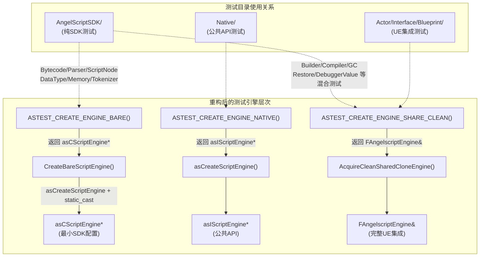

## 产品概述

对 `Plugins/Angelscript/Source/AngelscriptTest/Internals/` 目录下的 AngelScript SDK 内部类单元测试进行重构，解决当前测试层语义混乱、依赖过重、纯度不足的问题。

## 核心功能

1. **目录重命名**：将 `Internals/` 重命名为 `AngelScriptSDK/`，精准传达测试对象为 AngelScript SDK 内部类，与同级目录命名风格保持一致
2. **引入纯净引擎工厂**：新增 `CreateBareScriptEngine()` 工厂函数，返回仅做最小 SDK 配置的 `asCScriptEngine*`，不注册任何 UE 类型绑定；配套提供 RAII guard 和新宏 `ASTEST_CREATE_ENGINE_BARE` + `ASTEST_BEGIN_BARE` / `ASTEST_END_BARE`
3. **分类迁移测试文件**：

- **纯 SDK 类测试**（Tokenizer、Memory、ScriptNode、Bytecode、Parser、DataType 等已有或可改为仅需 `asCScriptEngine*` 的测试）：改用 `CreateBareScriptEngine()` 或直接实例化 SDK 内部类，移除 `FAngelscriptEngine` 依赖
- **混合依赖测试**（Compiler、Builder 中使用 `BuildModule`/`CompileModuleWithSummary` 等 UE 高层能力的测试、Restore、DebuggerValue、GC、ContextPool、StructCppOps、TypeUsage 等）：保留 `ASTEST_CREATE_ENGINE_SHARE_CLEAN()` 模式不变，仅做路径字符串和 include 路径更新

4. **测试路径字符串统一更新**：所有测试中的 `Angelscript.TestModule.Internals.*` 更新为 `Angelscript.TestModule.AngelScriptSDK.*`
5. **文档同步更新**：更新涉及 Internals 引用的 AGENTS.md、TestCatalog.md、TestConventions.md、TESTING_GUIDE.md 等文档

## 技术栈

- 语言：C++ (UE Automation Test Framework)
- 构建：Unreal Build System (`.Build.cs`)
- 测试框架：`FAutomationTestBase` + `IMPLEMENT_SIMPLE_AUTOMATION_TEST` 宏
- SDK 依赖：AngelScript SDK 内部头文件 (`source/as_*.h`) 通过 `StartAngelscriptHeaders.h` / `EndAngelscriptHeaders.h` 包裹

## 实现方案

### 总体策略

采用"新增纯净引擎工厂 + 渐进式迁移"的方案。核心思路是：

1. 先在 `Shared/` 基础设施中新增 `CreateBareScriptEngine()` 工厂和配套宏，建立纯 SDK 测试的引擎创建能力
2. 将 Internals 目录物理重命名为 AngelScriptSDK，同步更新所有引用
3. 按文件分批将 "纯 SDK unwrap 模式" 的测试迁移到 bare engine，保持 "混合依赖模式" 不变

### 关键技术决策

**决策 1：`CreateBareScriptEngine()` 返回 `asCScriptEngine*` 而非 `asIScriptEngine*`**

- 理由：Internals 测试需要直接构造 `asCBuilder(asCScriptEngine*, asCModule*)`、`asCByteCode(&builder)` 等内部类实例，这些构造函数接受 `asCScriptEngine*` 而非公共接口 `asIScriptEngine*`。已有的 `ASTEST_CREATE_ENGINE_NATIVE()` 返回 `asIScriptEngine*`，适用于 Native/ 公共 API 测试层，但无法满足 SDK 内部类测试需求。
- 实现：`asCreateScriptEngine(ANGELSCRIPT_VERSION)` 返回 `asIScriptEngine*`，通过 `static_cast<asCScriptEngine*>()` 转换即可获得内部指针（这是 AngelScript SDK 的标准做法，所有现有 Internals 测试已在使用）。

**决策 2：新增 `ASTEST_CREATE_ENGINE_BARE` 宏族而非复用 NATIVE 宏**

- 理由：NATIVE 宏返回 `asIScriptEngine* NativeEngine`，其 BEGIN/END 对也按此变量名和公共接口设计。BARE 宏返回 `asCScriptEngine* BareEngine`，语义和类型不同，需要独立的宏定义以保持类型安全和代码清晰度。
- BARE 宏的 BEGIN/END 自动在 scope exit 调用 `BareEngine->ShutDownAndRelease()`，与 NATIVE 模式对称。

**决策 3：文件分类——哪些改、哪些不改**

根据对所有 19 个源文件的逐一审查：

| 文件 | 当前模式 | 目标动作 |
| --- | --- | --- |
| `AngelscriptTokenizerTests.cpp` | 已纯净（无引擎依赖） | 仅更新路径字符串 |
| `AngelscriptMemoryTests.cpp` | 已纯净（无引擎依赖） | 仅更新路径字符串 |
| `AngelscriptBytecodeTests.cpp` | unwrap 后只用 asCBuilder/asCByteCode | 改用 BARE 引擎 |
| `AngelscriptScriptNodeTests.cpp` | unwrap 后只用 asCParser/asCScriptNode | 改用 BARE 引擎 |
| `AngelscriptParserTests.cpp` | unwrap 后只用 asCParser/asCBuilder | 改用 BARE 引擎 |
| `AngelscriptDataTypeTests.cpp` | unwrap 后只用 asCDataType | 改用 BARE 引擎 |
| `AngelscriptTypeRegistryTests.cpp` | unwrap 后只用类型注册 | 评估是否可用 BARE |
| `AngelscriptBuilderTests.cpp` | 部分 unwrap + 部分 BuildModule | 混合，保留 SHARE_CLEAN |
| `AngelscriptCompilerTests.cpp` | BuildModule + 字节码解剖 | 混合，保留 SHARE_CLEAN |
| `AngelscriptGCInternalTests.cpp` | 需要完整 GC + 注册类型 | 混合，保留 SHARE_CLEAN |
| `AngelscriptRestoreTests.cpp` | 需要编译 + 保存加载 | 混合，保留 SHARE_CLEAN |
| `AngelscriptDebuggerValueTests.cpp` | 需要 CreateContext + 编译 | 混合，保留 SHARE_CLEAN |
| `AngelscriptContextPoolTests.cpp` | 需要 CreateContext | 混合，保留 SHARE_CLEAN |
| `AngelscriptTypeUsageTests.cpp` | 需要引擎类型系统 | 混合，保留 SHARE_CLEAN |
| `AngelscriptStructCppOpsTests.cpp` | 需要 UE 类型注册 | 混合，保留 SHARE_CLEAN |
| `AngelscriptFunctionCallerErasureTests.cpp` | 需要引擎 | 混合，保留 SHARE_CLEAN |
| `AngelscriptDebugReificationTests.cpp` | 需要引擎 | 混合，保留 SHARE_CLEAN |


### 性能考量

`CreateBareScriptEngine()` 只调用 `asCreateScriptEngine()` + `static_cast`，不注册 UE 类型绑定，初始化开销从毫秒级降到微秒级。对 CI 测试执行速度有正向影响。

## 实现注意事项

1. **include 路径更新**：目录重命名后，所有 `#include "../Shared/AngelscriptTestMacros.h"` 等相对路径不受影响（目录层级不变），但命名空间中的 `AngelscriptTest_Internals_*` 需要更新为 `AngelscriptTest_AngelScriptSDK_*`
2. **Build.cs 检查**：确认 `AngelscriptTest.Build.cs` 中无硬编码的 `Internals` 路径引用（UE 模块构建通常自动递归扫描源文件）
3. **Git 重命名追踪**：使用 `git mv` 重命名目录以保留文件历史
4. **向后兼容**：测试路径从 `Internals` 变为 `AngelScriptSDK` 是破坏性变更（外部 CI 过滤器如有使用 `Internals` 前缀需要同步更新），但根据项目当前仅在本仓库内使用，影响可控

## 架构设计



## 目录结构

```
Plugins/Angelscript/Source/AngelscriptTest/
├── Shared/
│   ├── AngelscriptTestMacros.h          # [MODIFY] 新增 ASTEST_CREATE_ENGINE_BARE / ASTEST_BEGIN_BARE / ASTEST_END_BARE 宏
│   └── AngelscriptTestUtilities.h       # [MODIFY] 新增 CreateBareScriptEngine() 工厂函数
├── AngelScriptSDK/                      # [RENAME from Internals/] SDK内部类测试目录
│   ├── AngelscriptBytecodeTests.cpp     # [MODIFY] 改用 BARE 引擎，更新路径字符串和命名空间
│   ├── AngelscriptBuilderTests.cpp      # [MODIFY] 仅更新路径字符串和命名空间
│   ├── AngelscriptCompilerTests.cpp     # [MODIFY] 仅更新路径字符串和命名空间
│   ├── AngelscriptContextPoolTests.cpp  # [MODIFY] 仅更新路径字符串和命名空间
│   ├── AngelscriptDataTypeTests.cpp     # [MODIFY] 改用 BARE 引擎，更新路径字符串和命名空间
│   ├── AngelscriptDebuggerValueTests.cpp # [MODIFY] 仅更新路径字符串和命名空间
│   ├── AngelscriptDebugReificationTests.cpp # [MODIFY] 仅更新路径字符串和命名空间
│   ├── AngelscriptFunctionCallerErasureTests.cpp # [MODIFY] 仅更新路径字符串和命名空间
│   ├── AngelscriptGCInternalTests.cpp   # [MODIFY] 仅更新路径字符串和命名空间
│   ├── AngelscriptMemoryTests.cpp       # [MODIFY] 仅更新路径字符串和命名空间
│   ├── AngelscriptParserTests.cpp       # [MODIFY] 改用 BARE 引擎，更新路径字符串和命名空间
│   ├── AngelscriptRestoreTests.cpp      # [MODIFY] 仅更新路径字符串和命名空间
│   ├── AngelscriptScriptNodeTests.cpp   # [MODIFY] 改用 BARE 引擎，更新路径字符串和命名空间
│   ├── AngelscriptStructCppOpsTests.cpp # [MODIFY] 仅更新路径字符串和命名空间
│   ├── AngelscriptStructCppOpsTestTypes.cpp # [MODIFY] 仅更新命名空间（如有）
│   ├── AngelscriptStructCppOpsTestTypes.h   # [MODIFY] 仅更新命名空间（如有）
│   ├── AngelscriptTokenizerTests.cpp    # [MODIFY] 仅更新路径字符串和命名空间
│   ├── AngelscriptTypeRegistryTests.cpp # [MODIFY] 评估并更新引擎模式+路径字符串
│   └── AngelscriptTypeUsageTests.cpp    # [MODIFY] 仅更新路径字符串和命名空间
├── Internals/
│   └── Internals-EngineFactory-Analysis.md # [DELETE] 已完成的分析文档，重构完成后归档或删除
└── TESTING_GUIDE.md                     # [MODIFY] 更新目录描述和宏说明
```

相关文档更新：

```
Documents/
├── Guides/
│   ├── TestCatalog.md                   # [MODIFY] Internals → AngelScriptSDK
│   ├── TestConventions.md               # [MODIFY] Internals → AngelScriptSDK
│   ├── TechnicalDebtInventory.md        # [MODIFY] Internals → AngelScriptSDK
│   └── Test.md                          # [MODIFY] Internals → AngelScriptSDK
├── Plans/
│   ├── Plan_ASInternalClassUnitTests.md # [MODIFY] Internals → AngelScriptSDK
│   └── Plan_NativeAngelScriptCoreTestRefactor.md # [MODIFY] Internals → AngelScriptSDK
└── Knowledges/
    └── 01_03_02_Test_Module_Layering_And_Automation_Prefix_System.md # [MODIFY] Internals → AngelScriptSDK
AGENTS.md                                # [MODIFY] Internals → AngelScriptSDK
AGENTS_ZH.md                             # [MODIFY] Internals → AngelScriptSDK
Plugins/Angelscript/AGENTS.md            # [MODIFY] Internals → AngelScriptSDK
```

## 关键代码结构

```cpp
// Shared/AngelscriptTestUtilities.h — 新增工厂函数
namespace AngelscriptTestSupport
{
    /**
     * Creates a bare asCScriptEngine with minimal AngelScript SDK configuration.
     * Does NOT register any UE type bindings, script class generators, or reflection hooks.
     * Intended for AngelScriptSDK tests that need a pure script engine sandbox.
     */
    inline asCScriptEngine* CreateBareScriptEngine()
    {
        asIScriptEngine* RawEngine = asCreateScriptEngine(ANGELSCRIPT_VERSION);
        return static_cast<asCScriptEngine*>(RawEngine);
    }
}
```

```cpp
// Shared/AngelscriptTestMacros.h — 新增 BARE 引擎宏
// BARE - Internal SDK asCScriptEngine without FAngelscriptEngine wrapper.
// Use for: AngelScriptSDK tests that directly operate on asCBuilder/asCByteCode/asCParser.
// Provides: asCScriptEngine* BareEngine
#define ASTEST_CREATE_ENGINE_BARE() \
    AngelscriptTestSupport::CreateBareScriptEngine()

#define ASTEST_BEGIN_BARE \
    if (BareEngine == nullptr) \
    { \
        AddError(TEXT("Failed to create bare AngelScript SDK engine")); \
        return false; \
    } \
    { \
        ON_SCOPE_EXIT { BareEngine->ShutDownAndRelease(); };

#define ASTEST_END_BARE \
    }
```

## Agent Extensions

### SubAgent

- **code-explorer**
- 用途：在迁移过程中批量搜索所有涉及 `Internals` 引用的文档和代码文件，确保不遗漏需要更新的引用点
- 预期结果：获取完整的受影响文件列表，包括文档、Plan、测试指南中的所有 Internals 引用

### MCP

- **knot**
- 用途：查询 UE-Angelscript 知识库中关于测试架构分层和引擎创建模式的相关信息，确认 `asCScriptEngine` 的 `static_cast` 转换模式在 Hazelight 参考实现中的使用情况
- 预期结果：验证 `CreateBareScriptEngine` 的设计方案与 SDK 参考实践一致

### Skill

- **writing-plans**
- 用途：本次重构属于多步骤任务，需要按规范写入 Plan 文档到 `Documents/Plans/`
- 预期结果：生成符合 Plan.md 规范的重构计划文档

- **verification-before-completion**
- 用途：重构完成后需要运行全量测试验证，确保路径重命名和引擎工厂切换不引入回归
- 预期结果：全部测试通过，无引入新的失败用例